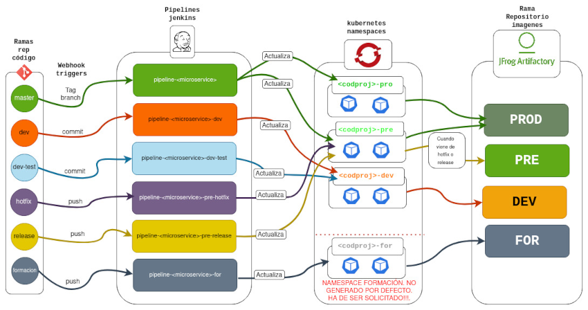

# DOCUMENTACIÓN CI/CD RENFE DEVOPS

El README.md ha sido generado por el onboarding de la factoria de devops de Renfe con la función de servir de ayuda a los equipos de desarrollo que realizen sus primeros pasos por los estandares definidos, para la factoria de aplicaciones, para que cumplan con los requisitos para la adaptación al ciclo de CI/CD. Los equipos de desarrollo pueden decidir elminar el README o sustituirlo por el que decidan para el repositorio de su código. 


### Indice

- [Guia de primeros pasos](#guia-de-primeros-pasos)
  - [Estructura del proyecto en Git](#estructura-del-repositorio)
    - [Branches](#branches)
  - [Iniciando el proyecto](#iniciando-el-proyecto)
    - [Resumen de la arquitectura CI/CD](#resumen-de-la-arquitectura-cicd)
    - [Subidas a desarrollo](#subidas-a-desarrollo)
    - [Subidas a producción](#subidas-a-produccion)
    - [Subidas a preproducción para hotfix](#subidas-a-preproduccion-para-hotfix)
    - [Subidas a preproducción para releases](#subidas-a-preproduccion-para-releases)
    - [Subidas a entorno de formación](#subidas-a-entorno-de-formacion)
    - [Propiedades de las aplicaciones](#propiedades-de-las-aplicaciones)
- [Guias componentes avanzados](#guias-componentes-avanzados)
  - [Gestion de permisos para el ProjectManager](#gestion-de-permisos-para-el-projectmanager)
  - [Truststores para acceso a servicios por HTTPS](#truststores-para-acceso-a-servicios-por-https)
    - [Guia de uso de los truststores con almacen generico](#guia-de-uso-de-los-truststores-con-almacen-generico)
      - [Responsabilidad sobre el almacen de certificados generico](#responsabilidad-sobre-el-almacen-de-certificados-generico)
      - [Usar el almacen generico en nuestro proyecto](#usar-el-almacen-generico-en-nuestro-proyecto)      
      - [Solicitar incluir certificado en el almacen generico](#solicitar-incluir-certificado-en-el-almacen-generico)
    - [Guia de uso de los truststores con almacen especifico](#guia-de-uso-de-los-truststores-con-almacen-especifico)
      - [Responsabilidad sobre el almacen de certificados especifico](#responsabilidad-sobre-el-almacen-de-certificados-especifico)
      - [Crear almacen específico en nuestro proyecto](#crear-almacen-especifico-en-nuestro-proyecto)
      - [Generar valor de trustcerts con los certicados que queremos incluir en nuestro almacen especifico](#generar-valor-de-trustcerts-con-los-certicados-que-queremos-incluir-en-nuestro-almacen-especifico)
      - [Usar el almacen específico en nuestro proyecto](#usar-el-almacen-especifico-en-nuestro-proyecto)      
      - [Incluir nuevo certificado en el almacen especifico](#incluir-nuevo-certificado-en-el-almacen-especifico)
  - [Gestion de secrets a traves de sealedsecrets](#gestion-de-secrets-a-traves-de-sealedsecrets)
      - [Funcionamiento de sealedsecrets](#funcionamiento-de-sealedsecrets)
      - [Crear un sealedsecret con kubeseal](#crear-un-sealedsecret-con-kubeseal)
      - [Servicio de creacion de sealedsecrets](#servicio-de-creacion-de-sealedsecrets)
  - [Readiness y liveness con actuator para los proyectos springboot](#readiness-y-liveness-con-actuator-para-los-proyectos-springboot)  
  - [Escalabilidad configurada por defecto en los diferentes entornos](#escalabilidad-configurada-por-defecto-en-los-diferentes-entornos)

## GUIA DE PRIMEROS PASOS

<!-- ABOUT THE PROJECT -->
### ESTRUCTURA DEL REPOSITORIO

El repositorio y sus ramas iniciales han sido generados por el proceso automatico de la factoria de software de Renfe. La estructura sigue la arquitectura definida y que explicamos en esta guia.

#### Branches

Las ramas inicialmente creadas en el repositorio son las siguientes:

  <ol>
    <li><a href="#master">master</a></li>
    <li><a href="#dev">dev</a></li>
    <li><a href="#dev-test">dev-test</a></li>
    <li><a href="#hotfix">hotfix</a></li>
    <li><a href="#release">release</a></li>
    <li><a href="#formacion">formacion</a></li>
  </ol>

##### master
Es la rama principal para los pases de código a producción.

##### dev (develop)
Es la rama del código de desarrollo más estable. Por estabilidad del código no es recomendado trabajar directamente sobre esta rama. Los desarrolladores deberían crear sus ramas feature para posteriormente hacer un merge en la rama dev (lo que, como veremos mas adelante provoca un pase en openshift).

##### dev-test
Cuando se quiere probar en desarrollo con cambios que aún no se consideran adecuados para consolidar en la rama principal de desarrollo (dev). Al igual que dev, con dev-test devería ser usada con features que una vez consolidadas se haga merge sobre esta rama (provocando un pase)

##### hotfix
Cuando se quiere probar en un entorno de preproducción cambios sobre el código productivo por problemas que se tengan que solucionar con con parcheado, y previo a su consolidación, tanto en desarrollo (dev), como en producción (master).

##### release
Similar al caso anterior pero en vez de cuando se trate del desarrollo de parches, es para el caso de nuevos releases.

##### formacion
Esta rama es una rama para el caso de que se quiera tener un entorno para realizar cursos de formación de la aplicación (o presentaciones). Este entorno no va a ninguno de los entornos existentes (dev, pre o pro). Cuando se desee activar un entorno de producción ha de hacerse mediante petición a operaciones que activará los recursos necesarios. Estos son creados, al igual que el resto, en el "onboarding", pero permanencen inactivos para no consumir recursos mientras no sea necesario usarlos. Igualmente cuando terminen los periodos de formación, estos recursos se volverán a desactivar.


<!-- GETTING STARTED -->
### INICIANDO EL PROYECTO

En los siguientes apartados vamos a explicar como se puede empezar con el proyecto y como se han automatizado las subidas de código en la factoría de software en un ciclo CI/CD.


#### Resumen de la arquitectura CICD

La arquitectura CI/CD se ha construido en base a contenedores y a una filosofía Gitops. Los contenedores son ejecutados en un entorno Kubernetes (OpenShift). La construcción de las imagenes a partir del código del repositorio se automatiza mediante webhooks a partir de acciones en Git, que activan pipelines Jenkins que compilan el código con maven y a partir de estas construyen las imagenes, y que finalmente sube los contenedores al entorno de Openshift adecuado (pro, pre, dev o for).


A continuación se van a explicar como hacer subidas a los entornos desde el repositorio y las ramas.



#### Subidas a desarrollo

> **Rama origen:** dev.<br/>**Evento que lanza el webhook:** commit en la rama dev.<br/>**Pipeline de construcción (Build Config):** pipeline-&#60;servicio&#62;-dev.<br/>**Ejecución de pipeline (Build):** pipeline-&#60;servicio&#62;-dev-XX (Donde XX es un incremental que va aumentando segun se ejecuta el pipeline).<br/>**Namespace donde se ejecutan pipelines de Jenkins:** &#60;codigo de proyecto&#62;-ci.<br/>**Namespace donde se ejecutan los pods (Project):** &#60;codigo de proyecto&#62;-dev.<br/>**Exige aprobaciones:** No.

1. Subir o actualizar código en la rama **dev** hace que se ejecute el webhook y entonces el pipeline 
2. Analizar la ejecución del pipeline de desarrollo que se ha empezado a ejecutar desde la [consola de openshift](https://oauth-openshift.apps.opo.renfe.es/oauth/authorize?client_id=console&redirect_uri=https%3A%2F%2Fconsole-openshift-console.apps.opo.renfe.es%2Fauth%2Fcallback&response_type=code&scope=user%3Afull&state=4ebd465c) en el namespace con el sufijo ci, y de prefijo el código de 3 letras de nuestro proyecto. Este pipeline siempre se nombra de la siguiente forma: **pipeline-<nombre_servicio>-dev**


3. Si ha ido bien se actualizarán los pods de desarrollo del servicio. Para poder ver el estado y los logs de arranque podemos ir a la consola de openshift.


#### Subidas a produccion 

> **Rama origen:** master.<br/>**Evento que lanza el webhook:** Tag en la rama master.<br/>**Pipeline de construcción (Build Config):** pipeline-&#60;servicio&#62;-pro.<br/>**Ejecución de pipeline (Build):** pipeline-&#60;servicio&#62;-pro-XX (Donde XX es un incremental que va aumentando segun se ejecuta el pipeline).<br/>**Namespace donde se ejecutan pipelines de Jenkins:** &#60;codigo de proyecto&#62;-ci.<br/>**Namespace 1 donde se ejecutan los pods (Project):** &#60;codigo de proyecto&#62;-pre.<br/>**Namespace 2 donde se ejecutan los pods (Project):** &#60;codigo de proyecto&#62;-pro.<br/>**Pre exige aprobaciones:** No.<br/>**Pro exige aprobaciones:** Si.<br/>**Grupo con autoridad para solicitar pase a producción:** GRP_OPO_<CODIGO APLICACIÓN>_REQUESTER.<br/>**Grupo con autoridad para autorizar pase a producción:** GRP_OPO_<CODIGO APLICACIÓN>_APPROVAL.

1. En este caso el commit no es el evento que ejecuta el CI/CD, para iniciar el proceso de pase a producción es necesario hacer un TAG en la rama master.
2. Analizar la ejecución del pipeline de producción que se ha empezado a ejecutar desde la [consola de openshift](https://oauth-openshift.apps.opo.renfe.es/oauth/authorize?client_id=console&redirect_uri=https%3A%2F%2Fconsole-openshift-console.apps.opo.renfe.es%2Fauth%2Fcallback&response_type=code&scope=user%3Afull&state=4ebd465c) en el namespace con el sufijo ci, y de prefijo el código de 3 letras de nuestro proyecto. Este pipeline siempre se nombra de la siguiente forma: **pipeline-<nombre_servicio>**
3. En este caso el pipeline se divide en dos fase, la primera que acaba en el namespace de pre <proyecto>-pre y la segunda que acaba en el de producción <proyecto>-pro.
4. La parte hasta que se esta el codigo corriendo en preproducción es similar al de desarrollo, para ver los logs y el estado de los pods es similar, salvo que entraremos en el namespace <proyecto>-pre.
5. Una vez que se ha probado en el entorno de preproducción, el responsable de lanzarlo a producción (perteneciente al grupo RDA GRP_OPO_<CODIGO APLICACIÓN>_REQUESTER) lo lanza desde el pipeline que ha permanecido en pausa hasta ese entonces. Para hacerlo ha de entrar en la consola de Jenkins  y desde el pipeline lanzarlo de nuevo. 
6. El pipeline no se ejecuta directamente, tiene que ser aprobado por una persona que pertenezca al grupo GRP_OPO_<CODIGO APLICACIÓN>_APPROVAL de RDA. Una vez aprobado ya se acualiza el pod del namespace <proyecto>-pro.
7. Una vez en producción, para ver los logs y el estado de los pods con el nuevo código, se hace igual que los anteriores, pero en el namespace <proyecto>-pro.

#### Subidas a desarrollo para pruebas de features

> **Rama origen:** dev-test.<br/>**Evento que lanza el webhook:** commit en la rama dev-test.<br/>**Pipeline de construcción (Build Config):** pipeline-&#60;servicio&#62;-dev-test.<br/>**Ejecución de pipeline (Build):** pipeline-&#60;servicio&#62;-dev-test-XX (Donde XX es un incremental que va aumentando segun se ejecuta el pipeline).<br/>**Namespace donde se ejecutan pipelines de Jenkins:** &#60;codigo de proyecto&#62;-ci.<br/>**Namespace donde se ejecutan los pods (Project):** &#60;codigo de proyecto&#62;-dev.<br/>**Exige aprobaciones:** No.

1. Subir o actualizar código en la rama **dev-test** hace que se ejecute el webhook y entonces el pipeline 
2. Analizar la ejecución del pipeline de dev-test que se ha empezado a ejecutar desde la [consola de openshift](https://oauth-openshift.apps.opo.renfe.es/oauth/authorize?client_id=console&redirect_uri=https%3A%2F%2Fconsole-openshift-console.apps.opo.renfe.es%2Fauth%2Fcallback&response_type=code&scope=user%3Afull&state=4ebd465c) en el namespace con el sufijo ci, y de prefijo el código de 3 letras de nuestro proyecto. Este pipeline siempre se nombra de la siguiente forma: **pipeline-<nombre_servicio>-dev-test**
3. El namespace donde se ejecuta el código es **<proyecto>-dev**. Para ver el estado y log de los pods se hace de manera similar a los anteriores en el namespace <proyecto>-dev


#### Subidas a preproduccion para hotfix

> **Rama origen:** hotfix.<br/>**Evento que lanza el webhook:** commit en la rama hotfix.<br/>**Pipeline de construcción (Build Config):** pipeline-&#60;servicio&#62;-hotfix.<br/>**Ejecución de pipeline (Build):** pipeline-&#60;servicio&#62;-hotfix-XX (Donde XX es un incremental que va aumentando segun se ejecuta el pipeline).<br/>**Namespace donde se ejecutan pipelines de Jenkins:** &#60;codigo de proyecto&#62;-ci.<br/>**Namespace donde se ejecutan los pods (Project):** &#60;codigo de proyecto&#62;-pre.<br/>**Exige aprobaciones:** No.

1. Subir o actualizar código en la rama **hotfix** hace que se ejecute el webhook y entonces el pipeline 
2. Analizar la ejecución del pipeline de hotfix que se ha empezado a ejecutar desde la [consola de openshift](https://oauth-openshift.apps.opo.renfe.es/oauth/authorize?client_id=console&redirect_uri=https%3A%2F%2Fconsole-openshift-console.apps.opo.renfe.es%2Fauth%2Fcallback&response_type=code&scope=user%3Afull&state=4ebd465c) en el namespace con el sufijo ci, y de prefijo el código de 3 letras de nuestro proyecto. Este pipeline siempre se nombra de la siguiente forma: **pipeline-<nombre_servicio>-hotfix**
3. El namespace donde se ejecuta el código es **<proyecto>-pre
4. Estos pases solo se pueden probar en preproducción, no tienen evolución a producción.


#### Subidas a preproduccion para releases

> **Rama origen:** release.<br/>**Evento que lanza el webhook:** commit en la rama release.<br/>**Pipeline de construcción (Build Config):** pipeline-&#60;servicio&#62;-release.<br/>**Ejecución de pipeline (Build):** pipeline-&#60;servicio&#62;-release-XX (Donde XX es un incremental que va aumentando segun se ejecuta el pipeline).<br/>**Namespace donde se ejecutan pipelines de Jenkins:** &#60;codigo de proyecto&#62;-ci.<br/>**Namespace donde se ejecutan los pods (Project):** &#60;codigo de proyecto&#62;-pre.<br/>**Exige aprobaciones:** No.

1. Subir o actualizar código en la rama **release** hace que se ejecute el webhook y entonces el pipeline 
2. Analizar la ejecución del pipeline de release que se ha empezado a ejecutar desde la [consola de openshift](https://oauth-openshift.apps.opo.renfe.es/oauth/authorize?client_id=console&redirect_uri=https%3A%2F%2Fconsole-openshift-console.apps.opo.renfe.es%2Fauth%2Fcallback&response_type=code&scope=user%3Afull&state=4ebd465c) en el namespace con el sufijo ci, y de prefijo el código de 3 letras de nuestro proyecto. Este pipeline siempre se nombra de la siguiente forma: **pipeline-<nombre_servicio>-release**
3. El namespace donde se ejecuta el código es **<proyecto>-pre
4. Estos pases solo se pueden probar en preproducción, no tienen evolución a producción.


#### Subidas a entorno de formacion

> **Rama origen:** formacion.<br/>**Evento que lanza el webhook:** commit en la rama formacion.<br/>**Pipeline de construcción (Build Config):** pipeline-&#60;servicio&#62;-formacion.<br/>**Ejecución de pipeline (Build):** pipeline-&#60;servicio&#62;-formacion-XX (Donde XX es un incremental que va aumentando segun se ejecuta el pipeline).<br/>**Namespace donde se ejecutan pipelines de Jenkins:** &#60;codigo de proyecto&#62;-ci.<br/>**Namespace donde se ejecutan los pods (Project):** &#60;codigo de proyecto&#62;-for.<br/>**Exige aprobaciones:** Si.<br/>**Grupo con autoridad para autorizar pase a formacion:** GRP_OPO_<CODIGO APLICACIÓN>_ADMIN.


1. Estos pases son un caso especial que se ejecuta en un entorno especial que incialmente esta inactivo. Para activarse, previo a realizar los despliegues se ha de solicitar su activación al departamento de devops. El motivo de esto es ahorrar los recursos que consume el entorno en tanto no haya necesidad de este entorno para formación o similares.
2. Subir o actualizar código en la rama **formacion** hace que se ejecute el webhook y entonces el pipeline 
3. Analizar la ejecución del pipeline de release que se ha empezado a ejecutar desde la [consola de openshift](https://oauth-openshift.apps.opo.renfe.es/oauth/authorize?client_id=console&redirect_uri=https%3A%2F%2Fconsole-openshift-console.apps.opo.renfe.es%2Fauth%2Fcallback&response_type=code&scope=user%3Afull&state=4ebd465c) en el namespace con el sufijo ci, y de prefijo el código de 3 letras de nuestro proyecto. Este pipeline siempre se nombra de la siguiente forma: **pipeline-<nombre_servicio>-formacion**
4. El namespace donde se ejecuta el código es **<proyecto>-for


### Propiedades de las aplicaciones

Las propiedades de las aplicaciones son cargadas para los contenedores a través de unos objetos de kubernetes llamados [**ConfigMaps**](https://kubernetes.io/es/docs/concepts/configuration/configmap/), estos elementos se cargan como variables en el contenedor y como tales han de ser leidas por la aplicacion. Se ha estandarizado que cada entorno (dev, pre, pro y for) ha de tener dos ConfigMaps (y también de secrets, que es similar a un configmap, pero para contraseñas, ***ver sección SealedSecrets.***).

La parte de configuración se encuentra dos ramas diferentes al código, esto es así porque por la metodología Gitops y gracias a el producto ArgoCD los recursos necesarios para el funcionamiento de la aplicación tienen que estar definidos como código y este producto se encarga de sincronizar lo que hay en el respositorio con lo que se encuentra en OpenShift. Son dos respositorios por entorno porque uno seráá el repositorio al que tendrá acceso los equipos de desarrollo con los ConfgMaps con las propiedades de la aplicación, y por otro lado la contraseñas y otros elementos necesarios pero que por su naturaleza solo puedan tener acceso los equipos de operaciones y de seguridad.

Para cada proyecto hay dos repositorios y cada repostorio tiene cinco ramas,una por cada entorno (dev, pre, pro y for), mas la de ci: 
  1. Ramas de repositorio **secops** en: <empresa>/secops/<proyecto>-config:
     + ci
     + dev
     + pre
     + pro
     + for
  2. Repositorios **devops** en: <empresa>/devops/<proyecto>-request:
     + ci
     + dev
     + pre
     + pro
     + for
     

> 
> El repositorio ***request*** de devops no es sincronizado directamente al OpenShift, antes hay una sicronización a través de un pipeline que lo traslada al repositorio config de devops (**Al que desarrollo no tiene acceso directo**). El pipeline es ejecutado directamente en el entorno de desarrollo y preproducción, y en producción ha de pasar por un ciclo de petición/aprobacion similar al de los pases a produción de código.

Enlaces(hay que sustituir las variables de empresa y proyecto):


+ Devops dev: https://git.renfe.es/opo/<empresa>/devops/<proyecto>-request/-/tree/ci

+ Devops pre: https://git.renfe.es/opo/<empresa>/devops/<proyecto>-request/-/tree/pre

+ Devops pro: https://git.renfe.es/opo/<empresa>/devops/<proyecto>-request/-/tree/pro

+ Devops for: https://git.renfe.es/opo/<empresa>/devops/<proyecto>-request/-/tree/for


## GUIAS COMPONENTES AVANZADOS

### Gestion de permisos para el ProjectManager

Los permisos a los desarrolladores y otros perfiles de gestión de desarrollo son actualizados por una, o varias personas asignadas en el proyecto como ***ProjectManager***, esta persona es incluida con los permisos adecuados para poder dar a su vez de alta y de baja usuarios.
Esto se hace a través de un ConfigMap al que tiene acceso en su proyecto, en devops, en el proyecto request.

El enlace sería el siguiente(sustiruir empresa y proyecto en el enlace):

+ https://git.renfe.es/opo/<empresa>/devops/<proyecto>/<proyecto>-request/-/blob/ci/base/admin-developers/user-roles.yaml


### Truststores para acceso a servicios por HTTPS

- Cuando un servicio tene que acceder a otro servicio por https se produce una negociación TLS en la cual hay un intercambio de certificados. En la mayoria de las ocasiones el servicio exige tener el certificado de la parte servidora para poder continuar con la conexión, y de no tenerlo devolverá error.

- En java esto está resuelto a través de la propiedad **javax.net.ssl.trustStore**, esta propiedad está apuntando a un **almacen de certificados**. Normalmente la versión de java viene con un almacen de certificados con la mayoría de certificados mas conocidos del mercado, pero en ocasiones, cuando el certificado del servicio al que queremos atacar no está en este almacen, hay que incluirlo de alguna manera sino queremos tener el error anteriormente descrito.

- El departamento de devops de Renfe ha creado un mecanismo que failita el manejo de los mismos y que se integra con el cluster de kubernetes y gitops. Se han diseñado dos maneras diferentes de gestionarlos, una es usando un almacen genérico, y la otra usando un almacen especifico del servicio.

#### Guia de uso de los truststores con almacen generico

##### Responsabilidad sobre el almacen de certificados generico

  - Este almacen es gestionado por el departamento de devops, y es este departamento el que hace el mantenimiento.

##### Usar el almacen generico en nuestro proyecto

  - El almacen genérico esta en nuestro proyecto por defecto y las propiedades JAVA_OPTIONS_TRUSTSTORE a través del configmap con las variables de entorno están por defecto apuntando al fichero truststore generico


fichero modificado
```bash
apiVersion: v1
kind: ConfigMap
metadata:
  name: vcl-web-devops-config
data:
  JAVA_OPTIONS_TRUSTSTORE: "-Djavax.net.ssl.trustStore=/secret/trustore/generic/cacerts -Djavax.net.ssl.trustStoreType=JKS"
```
  - Como se puede ver en el ejemplo, el nombre del configmap siempre será <nombre servicio>-devops-config y está en nuestro proyecto, en devops, y definido en el fichero  **<nombre servicio>/config-map.yaml** 

##### Solicitar incluir certificado en el almacen generico

  - Aunque este almacen va a tener muchas de los certificados necesarios, es posible que en ocasiones, haya algun servicio con un certificado que no está incluido, en tal caso hemos de solicitar al departamento de devops que lo incluya, pasandole el certificado, o indicandole la url donde está el certificado que nos da error. Una vez que el departamento de sistemas realice el cambio será necesario el reinicio del pod para que coja el cambio.


#### Guia de uso de los truststores con almacen especifico

##### Responsabilidad sobre el almacen de certificados especifico

  - Este almacen es gestionado por el equipo de desarrollo que lo requiere, tanto para darlo de alta, como para actualizarlo con nuevos certificados. Por parte de devops, lo única tarea de gestión de tiene que hacer es incluir el configmap en el pod para que sea accesible por el servicio.

##### Crear almacen especifico en nuestro proyecto

  - Para crear el almacen es necesario crear un configmap, podemos elegir el nombre que deseemos. El nombre que elijamos será el nombre de la secret que un proceso del departamento de devops creará en nuestro namespace con el truststore.
  - Estructura del configmap:
```bash
kind: ConfigMap
apiVersion: v1
metadata:
  name: arq-certpubs
    labels:
      renfe.ops.cacerts-manager.app: app
data:
  trustcerts: ICAgIC0tLS0tQkVHSU4gQ0VSVElGSUNBVEUtLS0tLQogICAgTUlJRGlEQ0NBbkNnQXdJQkFnSUJBREFOQmdrcWhraUc5dzBCQVFVRkFEQkVNUXN3Q1FZRFZRUUdFd0pGVXpFWQogICAgTUJZR0ExVUVDaE1QVW1WdVptVWdUM0JsY21Ga2IzSmhNUnN3R1FZRFZRUURFeEpTWlc1bVpTQlBjR1Z5WVdSdgogICAgY21FZ1EwRXdIaGNOTVRBeE1qTXhNakl3TURBd1doY05Nekl3TWpBek1qRTFPVFU1V2pCRU1Rc3dDUVlEVlFRRwogICAgRXdKRlV6RVlNQllHQTFVRUNoTVBVbVZ1Wm1VZ1QzQmxjbUZrYjNKaE1Sc3dHUVlEVlFRREV4SlNaVzVtWlNCUAogICAgY0dWeVlXUnZjbUVnUTBFd2dnRWlNQTBHQ1NxR1NJYjNEUUVCQVFVQUE0SUJEd0F3Z2dFS0FvSUJBUUN1OUY4KwogICAgNmNNQUI4VWlKUHErc09xSnFQaDd4WjI5YTBIeGhJcnhPRGFlT0prZjVqdFNDVWF5Q2ZwM05mSDlQMjFxVGxPRQogICAgZzFoUDNyNlI3TDdnaTdqQ0FSZmRTTnMvSmpBckpXNTMvcmpWNWlUSzNDUUFnRG1OQW9iKzRlZmZ3M0JxN1hyOQogICAgQmt1bWozTENtMTI1d3FicjltWFUxeTN2WmEzUG9ZUnYxTjZHazJFV0FlS0Q5U1ZpTUkwUUZsT0JXdVZCaGdlQQogICAgTStZWUQwSDV6N2tXWXlCcG1nZ3ZGZGtDdDhUYWUwbW5rMlNFNmN4dnA4N0Y2Tm9UTXMvZk9WNENnbHJTT3FCKwogICAgMkxYUVJZMDZEc3BCWkFJY1lmWmRDS0NrT0tYQ0txTCs4TUFkUlVoenBqdkxtM2NnUERRaTI2NnRTK3lNaTdCTQogICAga05xYVp0cVRjdG9uZWUyZkFnTUJBQUdqZ1lRd2dZRXdQd1lKWUlaSUFZYjRRZ0VOQkRJVE1FZGxibVZ5WVhSbAogICAgWkNCaWVTQjBhR1VnVTJWamRYSnBkSGtnVTJWeWRtVnlJR1p2Y2lCNkwwOVRJQ2hTUVVOR0tUQU9CZ05WSFE4QgogICAgQWY4RUJBTUNBUVl3RHdZRFZSMFRBUUgvQkFVd0F3RUIvekFkQmdOVkhRNEVGZ1FVME9tNFdQTWhaYVlvbHVXSgogICAgMkYwQzBMNm8vTGt3RFFZSktvWklodmNOQVFFRkJRQURnZ0VCQUJScG41K0RMczk1dXB5UlJEWElzbmQ2c3ByZgogICAgN2dsTFp0QmxhUk5hdDlzMFUzdXZQaEhYZlhLOHp5M1lZVk5VSXUzQklLQTFNM1NsV2F0bUxTR09MU1YzYXdXSAogICAgRUJiUnpVWGk0QVV6QmVXdjc4V2M2dWJBMk1taDJMdGJnYThBSVREY2RIWFM5MFJ6UmFnY1FBQkhJTG9DY2NKWQogICAgUWZKT3RsQmExQmZhclQvcUpDQ0VqeExBNlVEa3NzcFpDd3h4N0lOcFZBYk9lOTZab0xJalI4TEpwZ1N3Rm1tZgogICAgSFhvQUdwK0V5VVdmL3NXWXFjOHlWUXcxM3VOWmNSU1BhWmRJeGlQSmZBYnRwSnhla0lNRyt1V29WNE9Zeml2MQogICAgMkhqdVVTNlZuMmtTTzEyUzlzWTI1cy9pcXZxV3lBanFSVmE0OWwrbFZjTUY4dlRmOUp1UVFVN3BsNU09CiAgICAtLS0tLUVORCBDRVJUSUZJQ0FURS0tLS0tCiAgICAtLS0tLUJFR0lOIENFUlRJRklDQVRFLS0tLS0KICAgIE1JSUR6VENDQXJXZ0F3SUJBZ0lCQVRBTkJna3Foa2lHOXcwQkFRVUZBREJFTVFzd0NRWURWUVFHRXdKRlV6RVkKICAgIE1CWUdBMVVFQ2hNUFVtVnVabVVnVDNCbGNtRmtiM0poTVJzd0dRWURWUVFERXhKU1pXNW1aU0JQY0dWeVlXUnYKICAgIGNtRWdRMEV3SGhjTk1URXdPREV4TWpJd01EQXdXaGNOTWpJd01qQXpNakUxT1RVNVdqQm9NUXN3Q1FZRFZRUUcKICAgIEV3SkZVekVZTUJZR0ExVUVDaE1QVW1WdVptVWdUM0JsY21Ga2IzSmhNUlV3RXdZRFZRUUxFd3hCY0d4cFkyRmoKICAgIGFXOXVaWE14S0RBbUJnTlZCQU1USDFKbGJtWmxJRTl3WlhKaFpHOXlZU0JCY0d4cFkyRmphVzl1WlhNZ1EwRXcKICAgIGdnRWlNQTBHQ1NxR1NJYjNEUUVCQVFVQUE0SUJEd0F3Z2dFS0FvSUJBUURvU0RMbXo2eXNKL2pGWk83YUpQemsKICAgIFFFU21aUE1wMG91N0wxM3JML1BLVjFzQ1pocXJka3VxNDBnenI0NTAvUENOT2RSMzdjQlZtczVJeGhqSFVwNW8KICAgIENHTUhYSlNOdTBvV0FJbGtDUmt4SkYrZG9SeHRZN1NwQnl3ZkJ5bDhXK3NsaU92aXNCc3BhMllURGQ5TGpXWTIKICAgIHZiN2laVGVmd2FGVGt6Qld0bWJicHd6WENENHJCdnlqdmFqazkxdTBXTzg0ekdaQnJES21EWFVwMDJqN2ZQamEKICAgIEp0OEZyVE1sM0IyRzNFWWZXdURDOW0rRmZxZ1k2TTBOSzNSUGl2dmUvamZBSmFGRE1Zc0F2eG1CMEJQRUE5VzEKICAgIG1ZU2krQVdRcVd1Q2ppUUJWd1EwYjBYUmhhU2p5V0RXVUlrOUdBZG1lN21nMldFUjZiMTJQSWxlQ2hKTlErV3oKICAgIEFnTUJBQUdqZ2FVd2dhSXdQd1lKWUlaSUFZYjRRZ0VOQkRJVE1FZGxibVZ5WVhSbFpDQmllU0IwYUdVZ1UyVmoKICAgIGRYSnBkSGtnVTJWeWRtVnlJR1p2Y2lCNkwwOVRJQ2hTUVVOR0tUQU9CZ05WSFE4QkFmOEVCQU1DQVFZd0R3WUQKICAgIFZSMFRBUUgvQkFVd0F3RUIvekFkQmdOVkhRNEVGZ1FVYUM5YkxIK0dFSTJ0ZUNjWVVsSlZkNDE5bm53d0h3WUQKICAgIFZSMGpCQmd3Rm9BVTBPbTRXUE1oWmFZb2x1V0oyRjBDMEw2by9Ma3dEUVlKS29aSWh2Y05BUUVGQlFBRGdnRUIKICAgIEFBaG9XWW5WN3RlUk5SNGhoK29qSFp0YWljQTVoRzVsbHFMZ0cycHFtdEJIYmwzWUQ4SmtyWm5ZYlR2M1VaeksKICAgIHQzeEwxMHFJVWFSdUtNQ1Q0NElnT1h5UEsrdkpCbzJHTVZ1UkNVQzEwUDBBMjYvQnBNSlJHeXJxczZIanNnanoKICAgIEdMSnRhSlNxUlBlNFZqNEp2ZEppTWVmay8vZThtUWt1dzNJZ1dESXFweGxJQWZQSU5lNjlPTjdMRHM0VDR0ZEIKICAgIDF6am0vVUZWTElyOENyb0tOaUwyWnp5TzZCa1VoVXk0NWR1Y1FxWnorKytudDZESVZ3eUEwZ0xQK1dEdUlBdG8KICAgIDREUWFabFFGZEdDVjJlRk4rQ2MwQlZJL3hEdmNLSXlmQXJkc0xBSEV5ZjdRcE1hMU1IN2ZuclhJYWFGaXF1U3cKICAgIExyTGpsaG5zeENWaHk4TlZjVlh6U09rPQogICAgLS0tLS1FTkQgQ0VSVElGSUNBVEUtLS0tLQoK
```
  - **renfe.ops.cacerts-manager.app: app**, En el configmap, obligatoriamente, añadiremos la etiqueta tal cual. Es la manera que tiene el proceso de gestión de almacenes de saber que configmaps tienen los certificados que deben incluir en la secret que nos crearán.

  - **trustcerts**, esta clave es el identificador de los certificados, el valor lo creamos de la manera que explicamos en el siguiente apartado.

##### Generar valor de trustcerts con los certicados que queremos incluir en nuestro almacen especifico

  - Las instrucciones que se van a dar son para hacerlo en un entorno linux con las herramientas que nos ofrece. Para otros sistemas habría que buscar las alternativas a estas herramientas.

  1. Crear un fichero tipo pem con todos los certificados que vamos a incluir:

```bash
----- BEGIN CERTIFICATE -----
(certificado en base64)
----- END CERTIFICATE -----
----- BEGIN CERTIFICATE -----
(certificado en base64)
----- END CERTIFICATE -----
...
----- BEGIN CERTIFICATE -----
(certificado en base64)
----- END CERTIFICATE -----  
```

```bash
user@nuc-linux:~$ cat pubcerts.pem 
-----BEGIN CERTIFICATE-----
MIIDiDCCAnCgAwIBAgIBADANBgkqhkiG9w0BAQUFADBEMQswCQYDVQQGEwJFUzEY
MBYGA1UEChMPUmVuZmUgT3BlcmFkb3JhMRswGQYDVQQDExJSZW5mZSBPcGVyYWRv
cmEgQ0EwHhcNMTAxMjMxMjIwMDAwWhcNMzIwMjAzMjE1OTU5WjBEMQswCQYDVQQG
EwJFUzEYMBYGA1UEChMPUmVuZmUgT3BlcmFkb3JhMRswGQYDVQQDExJSZW5mZSBP
cGVyYWRvcmEgQ0EwggEiMA0GCSqGSIb3DQEBAQUAA4IBDwAwggEKAoIBAQCu9F8+
6cMAB8UiJPq+sOqJqPh7xZ29a0HxhIrxODaeOJkf5jtSCUayCfp3NfH9P21qTlOE
g1hP3r6R7L7gi7jCARfdSNs/JjArJW53/rjV5iTK3CQAgDmNAob+4effw3Bq7Xr9
Bkumj3LCm125wqbr9mXU1y3vZa3PoYRv1N6Gk2EWAeKD9SViMI0QFlOBWuVBhgeA
M+YYD0H5z7kWYyBpmggvFdkCt8Tae0mnk2SE6cxvp87F6NoTMs/fOV4CglrSOqB+
2LXQRY06DspBZAIcYfZdCKCkOKXCKqL+8MAdRUhzpjvLm3cgPDQi266tS+yMi7BM
kNqaZtqTctonee2fAgMBAAGjgYQwgYEwPwYJYIZIAYb4QgENBDITMEdlbmVyYXRl
ZCBieSB0aGUgU2VjdXJpdHkgU2VydmVyIGZvciB6L09TIChSQUNGKTAOBgNVHQ8B
Af8EBAMCAQYwDwYDVR0TAQH/BAUwAwEB/zAdBgNVHQ4EFgQU0Om4WPMhZaYoluWJ
2F0C0L6o/LkwDQYJKoZIhvcNAQEFBQADggEBABRpn5+DLs95upyRRDXIsnd6sprf
7glLZtBlaRNat9s0U3uvPhHXfXK8zy3YYVNUIu3BIKA1M3SlWatmLSGOLSV3awWH
EBbRzUXi4AUzBeWv78Wc6ubA2Mmh2Ltbga8AITDcdHXS90RzRagcQABHILoCccJY
QfJOtlBa1BfarT/qJCCEjxLA6UDksspZCwxx7INpVAbOe96ZoLIjR8LJpgSwFmmf
HXoAGp+EyUWf/sWYqc8yVQw13uNZcRSPaZdIxiPJfAbtpJxekIMG+uWoV4OYziv1
2HjuUS6Vn2kSO12S9sY25s/iqvqWyAjqRVa49l+lVcMF8vTf9JuQQU7pl5M=
-----END CERTIFICATE-----
-----BEGIN CERTIFICATE-----
MIIDzTCCArWgAwIBAgIBATANBgkqhkiG9w0BAQUFADBEMQswCQYDVQQGEwJFUzEY
MBYGA1UEChMPUmVuZmUgT3BlcmFkb3JhMRswGQYDVQQDExJSZW5mZSBPcGVyYWRv
cmEgQ0EwHhcNMTEwODExMjIwMDAwWhcNMjIwMjAzMjE1OTU5WjBoMQswCQYDVQQG
EwJFUzEYMBYGA1UEChMPUmVuZmUgT3BlcmFkb3JhMRUwEwYDVQQLEwxBcGxpY2Fj
aW9uZXMxKDAmBgNVBAMTH1JlbmZlIE9wZXJhZG9yYSBBcGxpY2FjaW9uZXMgQ0Ew
ggEiMA0GCSqGSIb3DQEBAQUAA4IBDwAwggEKAoIBAQDoSDLmz6ysJ/jFZO7aJPzk
QESmZPMp0ou7L13rL/PKV1sCZhqrdkuq40gzr450/PCNOdR37cBVms5IxhjHUp5o
CGMHXJSNu0oWAIlkCRkxJF+doRxtY7SpBywfByl8W+sliOvisBspa2YTDd9LjWY2
vb7iZTefwaFTkzBWtmbbpwzXCD4rBvyjvajk91u0WO84zGZBrDKmDXUp02j7fPja
Jt8FrTMl3B2G3EYfWuDC9m+FfqgY6M0NK3RPivve/jfAJaFDMYsAvxmB0BPEA9W1
mYSi+AWQqWuCjiQBVwQ0b0XRhaSjyWDWUIk9GAdme7mg2WER6b12PIleChJNQ+Wz
AgMBAAGjgaUwgaIwPwYJYIZIAYb4QgENBDITMEdlbmVyYXRlZCBieSB0aGUgU2Vj
dXJpdHkgU2VydmVyIGZvciB6L09TIChSQUNGKTAOBgNVHQ8BAf8EBAMCAQYwDwYD
VR0TAQH/BAUwAwEB/zAdBgNVHQ4EFgQUaC9bLH+GEI2teCcYUlJVd419nnwwHwYD
VR0jBBgwFoAU0Om4WPMhZaYoluWJ2F0C0L6o/LkwDQYJKoZIhvcNAQEFBQADggEB
AAhoWYnV7teRNR4hh+ojHZtaicA5hG5llqLgG2pqmtBHbl3YD8JkrZnYbTv3UZzK
t3xL10qIUaRuKMCT44IgOXyPK+vJBo2GMVuRCUC10P0A26/BpMJRGyrqs6Hjsgjz
GLJtaJSqRPe4Vj4JvdJiMefk//e8mQkuw3IgWDIqpxlIAfPINe69ON7LDs4T4tdB
1zjm/UFVLIr8CroKNiL2ZzyO6BkUhUy45ducQqZz+++nt6DIVwyA0gLP+WDuIAto
4DQaZlQFdGCV2eFN+Cc0BVI/xDvcKIyfArdsLAHEyf7QpMa1MH7fnrXIaaFiquSw
LrLjlhnsxCVhy8NVcVXzSOk=
-----END CERTIFICATE-----
```
  2. Pasamos el contenido de todo el fichero a base64 en una única linea:
```bash
user@nuc-linux:~$ cat pubcerts.pem |base64 -w 0
ICAgIC0tLS0tQkVHSU4gQ0VSVElGSUNBVEUtLS0tLQogICAgTUlJRGlEQ0NBbkNnQXdJQkFnSUJBREFOQmdrcWhraUc5dzBCQVFVRkFEQkVNUXN3Q1FZRFZRUUdFd0pGVXpFWQogICAgTUJZR0ExVUVDaE1QVW1WdVptVWdUM0JsY21Ga2IzSmhNUnN3R1FZRFZRUURFeEpTWlc1bVpTQlBjR1Z5WVdSdgogICAgY21FZ1EwRXdIaGNOTVRBeE1qTXhNakl3TURBd1doY05Nekl3TWpBek1qRTFPVFU1V2pCRU1Rc3dDUVlEVlFRRwogICAgRXdKRlV6RVlNQllHQTFVRUNoTVBVbVZ1Wm1VZ1QzQmxjbUZrYjNKaE1Sc3dHUVlEVlFRREV4SlNaVzVtWlNCUAogICAgY0dWeVlXUnZjbUVnUTBFd2dnRWlNQTBHQ1NxR1NJYjNEUUVCQVFVQUE0SUJEd0F3Z2dFS0FvSUJBUUN1OUY4KwogICAgNmNNQUI4VWlKUHErc09xSnFQaDd4WjI5YTBIeGhJcnhPRGFlT0prZjVqdFNDVWF5Q2ZwM05mSDlQMjFxVGxPRQogICAgZzFoUDNyNlI3TDdnaTdqQ0FSZmRTTnMvSmpBckpXNTMvcmpWNWlUSzNDUUFnRG1OQW9iKzRlZmZ3M0JxN1hyOQogICAgQmt1bWozTENtMTI1d3FicjltWFUxeTN2WmEzUG9ZUnYxTjZHazJFV0FlS0Q5U1ZpTUkwUUZsT0JXdVZCaGdlQQogICAgTStZWUQwSDV6N2tXWXlCcG1nZ3ZGZGtDdDhUYWUwbW5rMlNFNmN4dnA4N0Y2Tm9UTXMvZk9WNENnbHJTT3FCKwogICAgMkxYUVJZMDZEc3BCWkFJY1lmWmRDS0NrT0tYQ0txTCs4TUFkUlVoenBqdkxtM2NnUERRaTI2NnRTK3lNaTdCTQogICAga05xYVp0cVRjdG9uZWUyZkFnTUJBQUdqZ1lRd2dZRXdQd1lKWUlaSUFZYjRRZ0VOQkRJVE1FZGxibVZ5WVhSbAogICAgWkNCaWVTQjBhR1VnVTJWamRYSnBkSGtnVTJWeWRtVnlJR1p2Y2lCNkwwOVRJQ2hTUVVOR0tUQU9CZ05WSFE4QgogICAgQWY4RUJBTUNBUVl3RHdZRFZSMFRBUUgvQkFVd0F3RUIvekFkQmdOVkhRNEVGZ1FVME9tNFdQTWhaYVlvbHVXSgogICAgMkYwQzBMNm8vTGt3RFFZSktvWklodmNOQVFFRkJRQURnZ0VCQUJScG41K0RMczk1dXB5UlJEWElzbmQ2c3ByZgogICAgN2dsTFp0QmxhUk5hdDlzMFUzdXZQaEhYZlhLOHp5M1lZVk5VSXUzQklLQTFNM1NsV2F0bUxTR09MU1YzYXdXSAogICAgRUJiUnpVWGk0QVV6QmVXdjc4V2M2dWJBMk1taDJMdGJnYThBSVREY2RIWFM5MFJ6UmFnY1FBQkhJTG9DY2NKWQogICAgUWZKT3RsQmExQmZhclQvcUpDQ0VqeExBNlVEa3NzcFpDd3h4N0lOcFZBYk9lOTZab0xJalI4TEpwZ1N3Rm1tZgogICAgSFhvQUdwK0V5VVdmL3NXWXFjOHlWUXcxM3VOWmNSU1BhWmRJeGlQSmZBYnRwSnhla0lNRyt1V29WNE9Zeml2MQogICAgMkhqdVVTNlZuMmtTTzEyUzlzWTI1cy9pcXZxV3lBanFSVmE0OWwrbFZjTUY4dlRmOUp1UVFVN3BsNU09CiAgICAtLS0tLUVORCBDRVJUSUZJQ0FURS0tLS0tCiAgICAtLS0tLUJFR0lOIENFUlRJRklDQVRFLS0tLS0KICAgIE1JSUR6VENDQXJXZ0F3SUJBZ0lCQVRBTkJna3Foa2lHOXcwQkFRVUZBREJFTVFzd0NRWURWUVFHRXdKRlV6RVkKICAgIE1CWUdBMVVFQ2hNUFVtVnVabVVnVDNCbGNtRmtiM0poTVJzd0dRWURWUVFERXhKU1pXNW1aU0JQY0dWeVlXUnYKICAgIGNtRWdRMEV3SGhjTk1URXdPREV4TWpJd01EQXdXaGNOTWpJd01qQXpNakUxT1RVNVdqQm9NUXN3Q1FZRFZRUUcKICAgIEV3SkZVekVZTUJZR0ExVUVDaE1QVW1WdVptVWdUM0JsY21Ga2IzSmhNUlV3RXdZRFZRUUxFd3hCY0d4cFkyRmoKICAgIGFXOXVaWE14S0RBbUJnTlZCQU1USDFKbGJtWmxJRTl3WlhKaFpHOXlZU0JCY0d4cFkyRmphVzl1WlhNZ1EwRXcKICAgIGdnRWlNQTBHQ1NxR1NJYjNEUUVCQVFVQUE0SUJEd0F3Z2dFS0FvSUJBUURvU0RMbXo2eXNKL2pGWk83YUpQemsKICAgIFFFU21aUE1wMG91N0wxM3JML1BLVjFzQ1pocXJka3VxNDBnenI0NTAvUENOT2RSMzdjQlZtczVJeGhqSFVwNW8KICAgIENHTUhYSlNOdTBvV0FJbGtDUmt4SkYrZG9SeHRZN1NwQnl3ZkJ5bDhXK3NsaU92aXNCc3BhMllURGQ5TGpXWTIKICAgIHZiN2laVGVmd2FGVGt6Qld0bWJicHd6WENENHJCdnlqdmFqazkxdTBXTzg0ekdaQnJES21EWFVwMDJqN2ZQamEKICAgIEp0OEZyVE1sM0IyRzNFWWZXdURDOW0rRmZxZ1k2TTBOSzNSUGl2dmUvamZBSmFGRE1Zc0F2eG1CMEJQRUE5VzEKICAgIG1ZU2krQVdRcVd1Q2ppUUJWd1EwYjBYUmhhU2p5V0RXVUlrOUdBZG1lN21nMldFUjZiMTJQSWxlQ2hKTlErV3oKICAgIEFnTUJBQUdqZ2FVd2dhSXdQd1lKWUlaSUFZYjRRZ0VOQkRJVE1FZGxibVZ5WVhSbFpDQmllU0IwYUdVZ1UyVmoKICAgIGRYSnBkSGtnVTJWeWRtVnlJR1p2Y2lCNkwwOVRJQ2hTUVVOR0tUQU9CZ05WSFE4QkFmOEVCQU1DQVFZd0R3WUQKICAgIFZSMFRBUUgvQkFVd0F3RUIvekFkQmdOVkhRNEVGZ1FVYUM5YkxIK0dFSTJ0ZUNjWVVsSlZkNDE5bm53d0h3WUQKICAgIFZSMGpCQmd3Rm9BVTBPbTRXUE1oWmFZb2x1V0oyRjBDMEw2by9Ma3dEUVlKS29aSWh2Y05BUUVGQlFBRGdnRUIKICAgIEFBaG9XWW5WN3RlUk5SNGhoK29qSFp0YWljQTVoRzVsbHFMZ0cycHFtdEJIYmwzWUQ4SmtyWm5ZYlR2M1VaeksKICAgIHQzeEwxMHFJVWFSdUtNQ1Q0NElnT1h5UEsrdkpCbzJHTVZ1UkNVQzEwUDBBMjYvQnBNSlJHeXJxczZIanNnanoKICAgIEdMSnRhSlNxUlBlNFZqNEp2ZEppTWVmay8vZThtUWt1dzNJZ1dESXFweGxJQWZQSU5lNjlPTjdMRHM0VDR0ZEIKICAgIDF6am0vVUZWTElyOENyb0tOaUwyWnp5TzZCa1VoVXk0NWR1Y1FxWnorKytudDZESVZ3eUEwZ0xQK1dEdUlBdG8KICAgIDREUWFabFFGZEdDVjJlRk4rQ2MwQlZJL3hEdmNLSXlmQXJkc0xBSEV5ZjdRcE1hMU1IN2ZuclhJYWFGaXF1U3cKICAgIExyTGpsaG5zeENWaHk4TlZjVlh6U09rPQogICAgLS0tLS1FTkQgQ0VSVElGSUNBVEUtLS0tLQo=
```
  - 3. Una vez tenemos el valor, lo añadimos al configmap que estamos creando:
```bash
kind: ConfigMap
apiVersion: v1
metadata:
  name: arq-certpubs
    labels:
      renfe.ops.cacerts-manager.app: app
data:
  trustcerts: ICAgIC0tLS0tQkVHSU4gQ0VSVElGSUNBVEUtLS0tLQogICAgTUlJRGlEQ0NBbkNnQXdJQkFnSUJBREFOQmdrcWhraUc5dzBCQVFVRkFEQkVNUXN3Q1FZRFZRUUdFd0pGVXpFWQogICAgTUJZR0ExVUVDaE1QVW1WdVptVWdUM0JsY21Ga2IzSmhNUnN3R1FZRFZRUURFeEpTWlc1bVpTQlBjR1Z5WVdSdgogICAgY21FZ1EwRXdIaGNOTVRBeE1qTXhNakl3TURBd1doY05Nekl3TWpBek1qRTFPVFU1V2pCRU1Rc3dDUVlEVlFRRwogICAgRXdKRlV6RVlNQllHQTFVRUNoTVBVbVZ1Wm1VZ1QzQmxjbUZrYjNKaE1Sc3dHUVlEVlFRREV4SlNaVzVtWlNCUAogICAgY0dWeVlXUnZjbUVnUTBFd2dnRWlNQTBHQ1NxR1NJYjNEUUVCQVFVQUE0SUJEd0F3Z2dFS0FvSUJBUUN1OUY4KwogICAgNmNNQUI4VWlKUHErc09xSnFQaDd4WjI5YTBIeGhJcnhPRGFlT0prZjVqdFNDVWF5Q2ZwM05mSDlQMjFxVGxPRQogICAgZzFoUDNyNlI3TDdnaTdqQ0FSZmRTTnMvSmpBckpXNTMvcmpWNWlUSzNDUUFnRG1OQW9iKzRlZmZ3M0JxN1hyOQogICAgQmt1bWozTENtMTI1d3FicjltWFUxeTN2WmEzUG9ZUnYxTjZHazJFV0FlS0Q5U1ZpTUkwUUZsT0JXdVZCaGdlQQogICAgTStZWUQwSDV6N2tXWXlCcG1nZ3ZGZGtDdDhUYWUwbW5rMlNFNmN4dnA4N0Y2Tm9UTXMvZk9WNENnbHJTT3FCKwogICAgMkxYUVJZMDZEc3BCWkFJY1lmWmRDS0NrT0tYQ0txTCs4TUFkUlVoenBqdkxtM2NnUERRaTI2NnRTK3lNaTdCTQogICAga05xYVp0cVRjdG9uZWUyZkFnTUJBQUdqZ1lRd2dZRXdQd1lKWUlaSUFZYjRRZ0VOQkRJVE1FZGxibVZ5WVhSbAogICAgWkNCaWVTQjBhR1VnVTJWamRYSnBkSGtnVTJWeWRtVnlJR1p2Y2lCNkwwOVRJQ2hTUVVOR0tUQU9CZ05WSFE4QgogICAgQWY4RUJBTUNBUVl3RHdZRFZSMFRBUUgvQkFVd0F3RUIvekFkQmdOVkhRNEVGZ1FVME9tNFdQTWhaYVlvbHVXSgogICAgMkYwQzBMNm8vTGt3RFFZSktvWklodmNOQVFFRkJRQURnZ0VCQUJScG41K0RMczk1dXB5UlJEWElzbmQ2c3ByZgogICAgN2dsTFp0QmxhUk5hdDlzMFUzdXZQaEhYZlhLOHp5M1lZVk5VSXUzQklLQTFNM1NsV2F0bUxTR09MU1YzYXdXSAogICAgRUJiUnpVWGk0QVV6QmVXdjc4V2M2dWJBMk1taDJMdGJnYThBSVREY2RIWFM5MFJ6UmFnY1FBQkhJTG9DY2NKWQogICAgUWZKT3RsQmExQmZhclQvcUpDQ0VqeExBNlVEa3NzcFpDd3h4N0lOcFZBYk9lOTZab0xJalI4TEpwZ1N3Rm1tZgogICAgSFhvQUdwK0V5VVdmL3NXWXFjOHlWUXcxM3VOWmNSU1BhWmRJeGlQSmZBYnRwSnhla0lNRyt1V29WNE9Zeml2MQogICAgMkhqdVVTNlZuMmtTTzEyUzlzWTI1cy9pcXZxV3lBanFSVmE0OWwrbFZjTUY4dlRmOUp1UVFVN3BsNU09CiAgICAtLS0tLUVORCBDRVJUSUZJQ0FURS0tLS0tCiAgICAtLS0tLUJFR0lOIENFUlRJRklDQVRFLS0tLS0KICAgIE1JSUR6VENDQXJXZ0F3SUJBZ0lCQVRBTkJna3Foa2lHOXcwQkFRVUZBREJFTVFzd0NRWURWUVFHRXdKRlV6RVkKICAgIE1CWUdBMVVFQ2hNUFVtVnVabVVnVDNCbGNtRmtiM0poTVJzd0dRWURWUVFERXhKU1pXNW1aU0JQY0dWeVlXUnYKICAgIGNtRWdRMEV3SGhjTk1URXdPREV4TWpJd01EQXdXaGNOTWpJd01qQXpNakUxT1RVNVdqQm9NUXN3Q1FZRFZRUUcKICAgIEV3SkZVekVZTUJZR0ExVUVDaE1QVW1WdVptVWdUM0JsY21Ga2IzSmhNUlV3RXdZRFZRUUxFd3hCY0d4cFkyRmoKICAgIGFXOXVaWE14S0RBbUJnTlZCQU1USDFKbGJtWmxJRTl3WlhKaFpHOXlZU0JCY0d4cFkyRmphVzl1WlhNZ1EwRXcKICAgIGdnRWlNQTBHQ1NxR1NJYjNEUUVCQVFVQUE0SUJEd0F3Z2dFS0FvSUJBUURvU0RMbXo2eXNKL2pGWk83YUpQemsKICAgIFFFU21aUE1wMG91N0wxM3JML1BLVjFzQ1pocXJka3VxNDBnenI0NTAvUENOT2RSMzdjQlZtczVJeGhqSFVwNW8KICAgIENHTUhYSlNOdTBvV0FJbGtDUmt4SkYrZG9SeHRZN1NwQnl3ZkJ5bDhXK3NsaU92aXNCc3BhMllURGQ5TGpXWTIKICAgIHZiN2laVGVmd2FGVGt6Qld0bWJicHd6WENENHJCdnlqdmFqazkxdTBXTzg0ekdaQnJES21EWFVwMDJqN2ZQamEKICAgIEp0OEZyVE1sM0IyRzNFWWZXdURDOW0rRmZxZ1k2TTBOSzNSUGl2dmUvamZBSmFGRE1Zc0F2eG1CMEJQRUE5VzEKICAgIG1ZU2krQVdRcVd1Q2ppUUJWd1EwYjBYUmhhU2p5V0RXVUlrOUdBZG1lN21nMldFUjZiMTJQSWxlQ2hKTlErV3oKICAgIEFnTUJBQUdqZ2FVd2dhSXdQd1lKWUlaSUFZYjRRZ0VOQkRJVE1FZGxibVZ5WVhSbFpDQmllU0IwYUdVZ1UyVmoKICAgIGRYSnBkSGtnVTJWeWRtVnlJR1p2Y2lCNkwwOVRJQ2hTUVVOR0tUQU9CZ05WSFE4QkFmOEVCQU1DQVFZd0R3WUQKICAgIFZSMFRBUUgvQkFVd0F3RUIvekFkQmdOVkhRNEVGZ1FVYUM5YkxIK0dFSTJ0ZUNjWVVsSlZkNDE5bm53d0h3WUQKICAgIFZSMGpCQmd3Rm9BVTBPbTRXUE1oWmFZb2x1V0oyRjBDMEw2by9Ma3dEUVlKS29aSWh2Y05BUUVGQlFBRGdnRUIKICAgIEFBaG9XWW5WN3RlUk5SNGhoK29qSFp0YWljQTVoRzVsbHFMZ0cycHFtdEJIYmwzWUQ4SmtyWm5ZYlR2M1VaeksKICAgIHQzeEwxMHFJVWFSdUtNQ1Q0NElnT1h5UEsrdkpCbzJHTVZ1UkNVQzEwUDBBMjYvQnBNSlJHeXJxczZIanNnanoKICAgIEdMSnRhSlNxUlBlNFZqNEp2ZEppTWVmay8vZThtUWt1dzNJZ1dESXFweGxJQWZQSU5lNjlPTjdMRHM0VDR0ZEIKICAgIDF6am0vVUZWTElyOENyb0tOaUwyWnp5TzZCa1VoVXk0NWR1Y1FxWnorKytudDZESVZ3eUEwZ0xQK1dEdUlBdG8KICAgIDREUWFabFFGZEdDVjJlRk4rQ2MwQlZJL3hEdmNLSXlmQXJkc0xBSEV5ZjdRcE1hMU1IN2ZuclhJYWFGaXF1U3cKICAgIExyTGpsaG5zeENWaHk4TlZjVlh6U09rPQogICAgLS0tLS1FTkQgQ0VSVElGSUNBVEUtLS0tLQoK
```

##### Usar el almacen especifico en nuestro proyecto

  - Los almacenes específicos no pueden estar en nuestro proyecto, ya que se basan en secrets de los que no sabemos el nombre de antemano. Para usarlo es necesario seguir los siguientes pasos:
    1. Hacer petición al departamento de devops, con la indicación del nombre que le hemos dado al configmap. De esta manera el departyamento de devops, incluirá en el objeto deployment la referencia a la secret, que será montada en el contenedor de nuestro servicio en el fichero: /secret/trustore/custom/cacerts 
    2. El departamento de devops incluira la secret en el contenedor con el nombre anteriormente descrito

```bash
...
    - mountPath: /secret/trustore/custom
      readOnly: true
      name: <nombre del configmap>
...
```
```bash
...
    - secret:
        secretName: <nombre del configmap>
        items:
          - key: cacerts
            path: cacerts
      name: <nombre del configmap> 
...
```

3. El almacen específico estará en nuestro proyecto una vez reinicemos el pod. Modificamos entonces las propiedades JAVA_OPTIONS_TRUSTSTORE a través del configmap para que apunte al nuevo truststore custom 


fichero sin modificar
```bash
apiVersion: v1
kind: ConfigMap
metadata:
  name: vcl-web-devops-config
data:
  JAVA_OPTIONS_TRUSTSTORE: "-Djavax.net.ssl.trustStore=/secret/trustore/generic/cacerts -Djavax.net.ssl.trustStoreType=JKS"
```
fichero modificado
```bash
apiVersion: v1
kind: ConfigMap
metadata:
  name: vcl-web-devops-config
data:
  JAVA_OPTIONS_TRUSTSTORE: "-Djavax.net.ssl.trustStore=/secret/trustore/custom/cacerts -Djavax.net.ssl.trustStoreType=JKS"
```
  - El nombre del configmap siempre será <nombre servicio>-devops-config y está en nuestro proyecto, en devops, y definido en el fichero  **<nombre servicio>/config-map.yaml** 

##### Incluir nuevo certificado en el almacen especifico

  - Como se ha dicho anteriormente, el equipo de desarrollo ha de repetir todo el proceso de creación, por supuesto con los certificados como deseemos que quede en ese momento, salvo que no hay que solicitar nada al departamento de devops, con modificar el configmap será suficiente. Si es necesario reiniciar el pod. **Ojo!!!** el proceso de creación de los certificados esta en un cron, no será hasta que pase el momento de ejecución que no se recreará el certificado a partir del configmap (normalmente se ejecutara cada 10 mins).


### Gestion de secrets a traves de sealedsecrets

  - El uso de contraseñas en git es una mala práctica. En un sistema gitops, sin embargo, es necesario definirlas de alguna manera. Para solucionar este problema se ha instalado un operador de kubernetes que se llama **sealedsecrets** y que, como su nombre indica, sirve para poder pasar las secret encriptadas. 

#### Funcionamiento de sealedsecrets

  - A grandes rasgos lo que hace el operador es crear un CR (custon resource) que se llama **SealedSecret**, este recurso es una secret encriptada con una clave publica que crea el operador, y que cuando añadimos esta sealedsecret a nuestro proyecto, el operador la encuentra y la desencripta con su clave privada y crea el secret desencriptado sin que sea necesario tenerlo asi definido en Git.

#### Crear un sealedsecret con kubeseal

  - El operador ofrece una utilidad para linux para poder encriptar las secrets. Para ello tenemos que tener la secret, kubeseal y la clave publica del operador en ese cluster. Ejecutamos lo siguiente:

clave publica
```bash
user@nuc-linux:~/Downloads/kk$ cat public-key-cert.pem 
-----BEGIN CERTIFICATE-----
MIIErTCCApWgAwIBAgIQLcepYLoKDQdbJXkjvaJ2XDANBgkqhkiG9w0BAQsFADAA
MB4XDTIxMDcxNTExNDI0OVoXDTMxMDcxMzExNDI0OVowADCCAiIwDQYJKoZIhvcN
AQEBBQADggIPADCCAgoCggIBAL3OrBlEjRLvK1Jus76sxhI5YjDy402VBslwxUtf
EtjIFAhwCY3MbbaKuNHyjx3AgxfNzCu30LpjfF5Yd7ocbkGNliI9ufYWzb3aUwue
Chrw6Jk3CfcYRUqykWlu5MW3Bkij6GumUjNiY2ZyfoRRKvdXj2vwVb2kyBnUDrZJ
LONvJ+tL6m/drWfQQvP7poU1vYqcoWicJHFHkcnhr5IJp7A6sDjMd2zamPNrdbzI
T3KePqoG+nKGZtZHdeWMkQKQ2ZD5FKfG2i86iq3KS1hKSOPLwJj0cZCHqg3ESWQT
iS5YQHcPy8Js9mojtYDdDJGaHeGrRyl0wSQ8uTcRO46pA1S57IRMjJjbqA3CTNmp
K5iYEZ7CBnYVN4d8czKBrDsA+kpOV9wg6ht8HiAvmYW63LYsyF04klzY8bPb8i7V
X3cjDgOzToqEUzPo69jKmGvZ6luD2Tsb3qYqLuOq0jLQzQvIF+2JbE0D1dfXVNGZ
nZCjlrCtOdMubv9MM2jNeDpj/jJM582zb7fShKmpDS5/hyDfIvcaELDiTMKu00eC
9D75d5yAQsq8X6rCyRtvLQ6rNrpzpbBdQlVYwaR75Gmz2hmTrHNh5z4Z7J+OfyMe
sinfC1a+4sGS654irc+Mr8dN3ICugtWjGWHh6OBfIlrSsY2bjajLPpUn5LDEN1NP
lZMJAgMBAAGjIzAhMA4GA1UdDwEB/wQEAwIAATAPBgNVHRMBAf8EBTADAQH/MA0G
CSqGSIb3DQEBCwUAA4ICAQAdrhxZAUMINfGOzZSeVfFUZ6wdLfS0si6hU5pgiNwH
LuWPhNBo9zAnL6dOjgDcm6mJw7atgNQc9bTEMixpxy9srzJiWagNwMqk0PSYqVXQ
dj88G0MUqkzL8kFrvXdAYJaGBwCKb1L0ZgP+9vJpcLnfaLabrchwvVm8+U9gPh+g
INeUwtkHgKj4hp0EVpQ0jr9Kli7TOPRPHxofa5o9O9kXxiN1I3ni80IIbe5W2wH8
OXq4fWdyWZCpMg1G9NURHsnx0Vc6vJfVitLMDTT5F5j7IAWnlEevRti2E8TKe4fD
1g+RerlXvaEv3ipLhdIF0PB+wqa+ziOL6tb38By98Yo7zkLvpkslmBTa86PPLnUS
ZqSXpuOZMyzU2wv4KjSoSnCMqZmA6rg/URelQ+WAJl55O1jAiWJ3QNFc52FaCU8l
B3ZeUN6WIBwTzMDba9zI2bf91Sb51qkec8RllG84gD8bISAhcBjawoajAwnhENIg
0fke/FM+0PwQZ9Ih5U4nxLp5xDCGNomdGocYMe59nEHaLlqe8+NNsMD5ZtUvxH6G
mNI6ozlByZ4asf7DvxN+zJlUtZGbUdvBWWpSb4zrJZBwddDwDqGh16cFWXAz026r
i8ju8TqGeL64Moci+AZxB2EXSbKGYyDZt4QA5JmUxWJhx5wwQOElTBBsoIu5ovHk
Tg==
-----END CERTIFICATE-----
```
secret a encriptar
```bash
user@nuc-linux:~/Downloads/kk$ cat secret-smh-dev.yaml
kind: Secret
apiVersion: v1
metadata:
  name: imb-pro-incidencias-secops-secret-prueba
  namespace: smh-dev
data:
  PRUEBA: UFBQUFBQUFBQUFBQUFBQUFBQUFBQUFBQUFBQUFBQUAo=
type: Opaque
```

comando crear el objeto sealedsecret
```bash
kubeseal --format=yaml --cert=public-key-cert.pem < secret-smh-dev.yaml > sealed-secret-smh-dev.yaml
```
#### Servicio de creacion de sealedsecrets

- A parte de el uso estandar se ha creado un mecanismo para simplificar la creación de las sealedsecrets. De nuevo depende de tener un sistema linux para ejecutarlo

1. Prerequisitos

- Imprescindible es ejecutarlo desde un sistema **linux**.
- Requisito necesario es dirponer de la utilidad **curl**.

2. Preparación

- Creamos un directorio vacio
- En el directorio creamos un fichero con la secret que queramos **"sellar"**. Muy importante es que, como nombre del fichero, tenemos que llamar a la secret **secret.yaml**. Este es el nombre de fichero que buscará el script.


```bash
user@nuc-linux:$ mkdir borrar
user@nuc-linux:~/borrar$ cd borrar
...
user@nuc-linux:~/borrar$ cat secret.yaml 
apiVersion: v1
data:
  POSTGRESQL_USER: aDNrWTRMdDJDRXpAdENYUV5x
  POSTGRESQL_PASSWORD: QFp1XjVIU25ITVQ1RUJnamh5
  POSTGRESQL_ADMIN_PASSWORD: QiNwdG13LWRSUUVAdlozTGZY
kind: Secret
metadata:
  name: osv-postgresql
  namespace: osv-dev
type: Opaque
```


3. Ejecución:

- Desde el directorio que hemos creado ejecutamos: bash  <(curl -s https://sealedsecret-selfsvc.apps.opo.renfe.es/script/seal-secret.sh)
- Una vez ejecutado, si no se han producido errores, tendremos disponible en el mismo directorio la secret en forma de sealedsecret para poder ser usada en donde lo necesitemos.


```bash
user@nuc-linux:~/borrar$ bash  <(curl -s https://sealedsecret-selfsvc.apps.opo.renfe.es/script/seal-secret.sh)
descargamos el binario kubeseal
  % Total    % Received % Xferd  Average Speed   Time    Time     Time  Current
                                 Dload  Upload   Total   Spent    Left  Speed
100 30.5M  100 30.5M    0     0  7464k      0  0:00:04  0:00:04 --:--:-- 7464k
descargamos el certificado publico
  % Total    % Received % Xferd  Average Speed   Time    Time     Time  Current
                                 Dload  Upload   Total   Spent    Left  Speed
100  3368  100  3368    0     0  73217      0 --:--:-- --:--:-- --:--:-- 73217
creamos la sealed secret
user@nuc-linux:~/borrar$ ls -ltra
total 16
-rw-rw-r--  1 user user  248 ago  9 15:55 secret.yaml
drwxr-x--- 47 user user 4096 sep  5 10:27 ..
-rw-rw-r--  1 user user 2501 sep  5 10:31 sealed-secret.yaml
drwxrwxr-x  2 user user 4096 sep  5 10:31 .
user@nuc-linux:~/borrar$ cat sealed-secret.yaml 
apiVersion: bitnami.com/v1alpha1
kind: SealedSecret
metadata:
  name: osv-postgresql
  namespace: osv-dev
spec:
  encryptedData:
    POSTGRESQL_ADMIN_PASSWORD: AgB2shAchGxM8Q0QyzmD2F+xMZOJngV7wuYEN/t7Jup3ZhGvsfvt5Q7sj9KCCM7t30hXwiPmkkcLrduS3FUDCcsBrRrYSZ/x7H0EQV6KuQH6zkr5TyzLsis8SQv4iNyJSZ9RBli2GQJU6O4H3r7mqrzVR9gjhG86jiK0AslIv+jp4JUh2CJBf+kEoaF13um4BuNozxdpFl51vhPbR5on35XGFNyzd9yOMezYxgJO+Mw6w6nNSY+/Su8Y5EN57eRYu+OdTxnTqntFJWvc9lKX7RUEpxbVgWgbPWzmhl1o4wbTB2wcjySz6O7YRlhdKjLaEoz6J2jnF59rq64EuTcEw2UIw9GCGFRFzAAbmPwcNMbO4iq5J1jkAPsjylFYdOXvdJnEJ3x/QA40j54t+2ouqrr00OxbYW9+GWTW8UdZ6k0J3kwwJR+fzKW28pkEJbCiy3cSgAtth/uhTyp5awIwOImPIckO5h08zJVOuukJVV/rALG8K+abT4j3Na3IRv/6DA9qU6LRsr7X3pZG/Z17+ThcDFJToUHgrOsZI3g48Ykr8mCXl+Nf5p6t/4tM3Y9w66jydQqKnC9k4+t9D5JG5Fy8qz4E6P3a8U+9lc+FcS/Qw9QgliIIsZkIBN3jt7XDEwmjYqbNQ+BbmP3oWG2helK7Geea46tw3ciSG+9nYfzNflxdLJOg0T2zTN2fgE68rvJFiAwuvfAwD0g8uodDVnPagt4=
    POSTGRESQL_PASSWORD: AgAaYbn1SkvEjO2zmzvwq3PF4vnZE+vc93ihg6p3OULCb5EOxVeQ1fEAdFE7JtCyoSSpuJoByi9qAmXJhfdY6fuSLR3AGvbCodX6cUEauS/PcYJmaKS731H6qV1xhksdSFnbKdB5zT65J5tVlXNZTxj5EYeg3X+ELQ1IwuyD9na061mHk3lGgivwtiK3Q4IULsFflsIE1AcpflDplY48vs4DZbrtVg29akawsj7vYNYXfZ1Rl7KWatvu1VB0EXIHleGrMeeyCnsTutRv0lSxIjV4tbFcuaA0jJ0h/BqXN/yw+tlzYD1Y139HBwDxpqdT7hCpb3xebbYi8hzk10aUt69MhsArY9gZahKBaw3swAyf+fO6aOvOOdjmLZgpwHcCrB4StKqeVeaSMYzEgGzPsO6d1n8mzs77YNPSZBhukynshhlijMw2QFA58AArTtyCOCXd+UK6Tu/oCEu9RGHXuY3DqU+2D5mBjsMSSw/daAjBarvfrBH9RGIOnSy+PTb6fGjHMNd6KegyC2xzxTfasNJjtCaQX8s0ZN1/oQcvN2GeERCzDpEI7fJOkzDA9vMBjBPjVnMPW7owInuc5tQfn+nTntwVhGRWYNm3eHKS5r5PxZ0P9jLzKsfAY8ql/gurCvNZjxoLwRzOUq/4Inp+VjIVNg74sRyvoxTzru6aWZnsV3s5reEOXrT15ORjM7ixlzeE0a5WBo5zBd7zdhLjHSrppIw=
    POSTGRESQL_USER: AgCRUlh4mt5wf+pxVBISqWDTo814aYKX1GdKKTA8IZ4fskT08YeZB5SQdYVm02zaG7AyMmTdH1r8gtY/0VkTSPOp1szqerz3XNgbiOJ+pDlvGdSfB520pWHuIiBF9JNyk6vnx3gyh1RhvMwWYLiTXaiZeW73s+8XTsikhFz5n01NvE6MPCngQ/oe8Fm5Kqy5/40nDyebLcEuUTqwkYE87A+c9mxx1etX8hOgPYD61dv2x/1rP1WzFBJPZd0q/wXdJsp7CKy/246LAhjAAsxmLWk3mvCvimxdRU/q8Pb0eLSZOloAMb3KKgzWq11vUCNvuugvGGO2cIcpstu4RiVtPaGmRtMaXtqRM/CX6mifOiDTS3APqoPIG3qtKanvA6QsoHRo30gFm7HN0MUQfq2Cqv2ijRdDSu5YIrt3G0NVED7A57fpZX64hjx1qVwL57YsfaCPIwavqZFJwnsFDajhbZJAyA9YmTS1zReX3l3sPqM2kNLUbHDbot90mtsGaDk8wf1zfDNgqtjXyjecZKmocdu9QbTIXvvKIC/G+nVgyv86ba/UbO126SF+OKjkT6Ncqa2zL4eXEpRJqjx7j7YbifGgzavqNq5bci+QfP/vMnFeAB5KV2+eEh8ZzMmxznqLs2uHeZcnMW6aMf2LkaYZC2fP0qa0sjkt1O04k6t0sykTDZ4NP7ImcWv7i348+sx6FWXd8ogS4iE+BjcCc4n9ynq3Ouw=
  template:
    metadata:
      name: osv-postgresql
      namespace: osv-dev
    type: Opaque
```

Usos alternativos
-----------------

- A parte de usar la utilidad para facilitar la construcción sin mas preocupaciones, es posible, con este servicio, descargar el kubeseal y la clave publica y hacerlo nosotros manualmente de la manera que se indicó en el apartado anterior.

- Recursos:
  1. Instrucciones: https://sealedsecret-selfsvc.apps.opo.renfe.es/instrucciones/instrucciones.txt
  2. Descarga de kubeseal: https://sealedsecret-selfsvc.apps.opo.renfe.es/kubeseal
  3. Descarga de certificado publico: https://sealedsecret-selfsvc.apps.opo.renfe.es/pub/pub.crt

### Readiness y liveness con actuator para los proyectos springboot

- Liveness y Readiness son dos herramientas que usa kubernetes para automatizar el estado del nodo en un servicio. La mayor diferenci que hay entre ambos mecanismos es que en el caso de liveness, al final si el sistema considera que está fallando el pod, **este se reinicia**. En cambio con readyness solo lo deja temporalmente fuera del servicio, esperando que de esta manera se recupere.

- Obviamente liveness se debe de usar para casos en los que consideremos que es necesario el reinicio para retomar el servicio, y readyness para los casos dode se considere que son fallos puntuales y que finalmente despues de un tiempo el nodo se recuperara.

- Para los proyectos spring-boot se añade automáticamente las urls **/actuator/health/readiness** y **/actuator/health/liveness**. En spring-boot son activadas a través del componente actuator **que ha de ser configurado por el equipo de desarrollo**.  [Documentación sobre actuator](https://www.baeldung.com/spring-boot-actuators)

### Escalabilidad configurada por defecto en los diferentes entornos

- En todos los entronos los pods están configurados para escalar dinámicamente ante cargas. Lo que sucede es que en desarrollo e integración, por ahorro de costes, la escalabilidad está configurada por defecto a min 1 y max 1, en realidad no escala a no ser que lo cambiemos esos valores.
- Si en el entorno de desarrollo e integración deseamos tener la posiblidad de levantar mas pod **deberíamos solicitarlo al departamento de devops**
- En producción por defecto el valor es de un pod minimo y, en caso de recibir carga que lo necesite levantaría un pod max como máximo. De la misma manera que en el caso anterior, para cambiar estos valores por defecto deveríamos solicitarlo al **departamento de devops**.

ejemplo de manifiesto de autoscaler
```bash
apiVersion: autoscaling/v2beta2
kind: HorizontalPodAutoscaler
metadata:
  name: hpa-vcl-dev
spec:
  maxReplicas: 2
  minReplicas: 1
  scaleTargetRef:
```